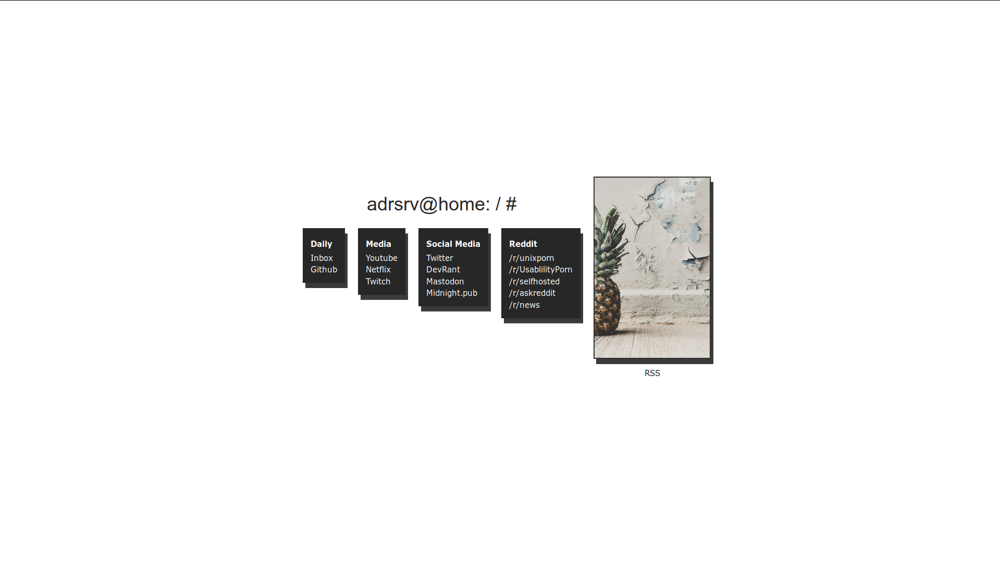
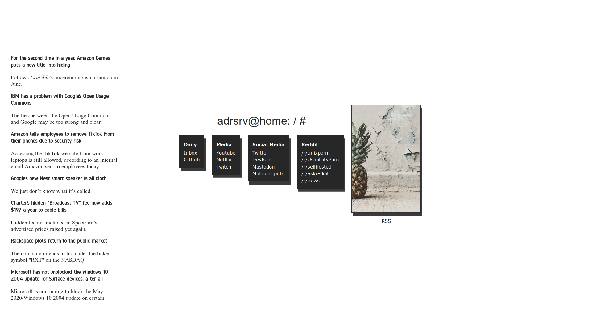

# simplehome

## What is this
This is a startpage I build for my webserver. I opted for a minimalist setup. It shows a collection of links, a picture and can show a rss feed.  
If you have any questions, hit me up on reddit (https://www.reddit.com/user/StringOfRandomInput)

## Prerequisits
For this to work, you need the rss-parser from rbren. You can get it here: https://github.com/rbren/rss-parser.

## Screenshot

here without rss feed

here with rss feed

## Functionality
As you notices on the screenshot, there is a text called "RSS" under the image. If you click on this text, it will toggle the RSS feed on the left side.  
Also: The code for showing a clock,the weather and performing a search is there, but not implemented, because of the simplicity  
