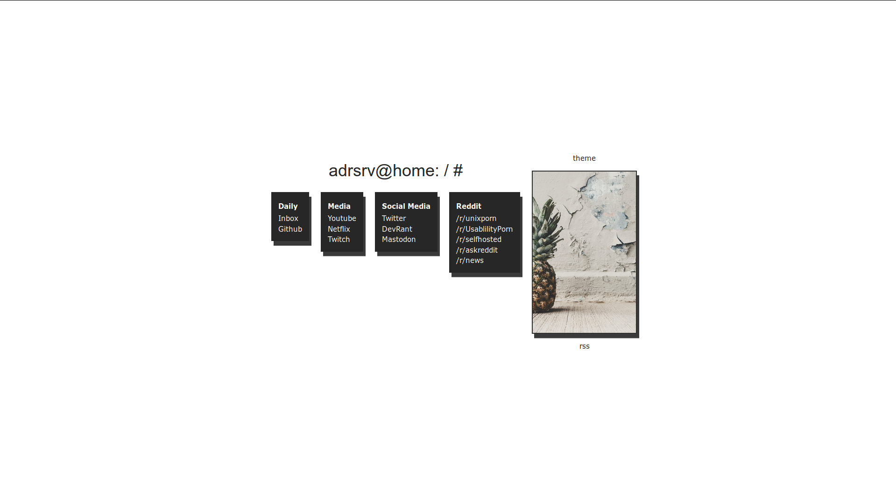

# simplehome

## What is this
This is a startpage I build for my webserver. I opted for a minimalist setup. It shows a collection of links, a picture and can show a rss feed.  
If you have any questions, hit me up on reddit (https://www.reddit.com/user/StringOfRandomInput)

## Prerequisits
For this to work, you need the rss-parser from rbren. You can get it here: https://github.com/rbren/rss-parser.

## Screenshot
### Light
without RSS

with RSS

### Dark
without RSS

with RSS

## Functionality
* toogle the rss feed with a button (the "rss" text under the image)
* switch between light and dark theme with a button (the "theme" text ontop of the image)
* dynamic light or darkmode depending on time (8am to 8pm is lightmode, 8pm to 8am darkmode)
* specify the number of articles to render. To do this change `articlecount =` to the desired number or set it to `'all'` to render all articles

Also: The code for showing a clock,the weather and performing a search is there, but not implemented, because of the simplicity  
